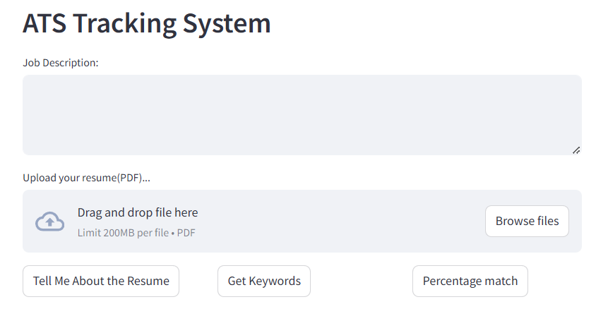
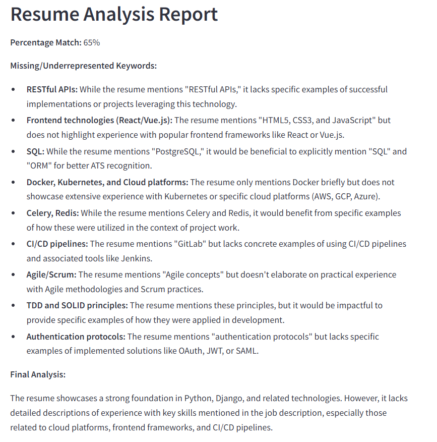

## ATS Resume Scanner

This is a Streamlit web application for an Applicant Tracking System (ATS) Resume Scanner. It allows users to upload a PDF resume and a job description, and then provides various analyses based on the uploaded documents.

### Features

- **Upload PDF Resume**: Users can upload their resume in PDF format.
- **Input Job Description**: Users can input the job description in a text area.
- **Tell Me About the Resume**: Provides an evaluation of the candidate's profile against the job description, highlighting strengths and weaknesses.
- **Get Keywords**: Identifies specific skills and keywords necessary for the resume to have maximum impact, provided in JSON format.
- **Percentage Match**: Evaluates the percentage match of the resume with the job description, along with keywords missing and final thoughts.

### Installation

#### Manual
```
git clone https://github.com/your_username/ResumeScanner-StreamlitWebsite.git
cd ResumeScanner-StreamlitWebsite

# on macOS
python3 -m venv venv
source venv/bin/activate

# on Windows
python -m venv venv
venv\Scripts\activate

pip install -r requirements.txt

(create your .env file like .env.sample)

streamlit run app.py
```
#### Docker
``` 
git clone https://github.com/your_username/ResumeScanner-StreamlitWebsite.git
cd ResumeScanner-StreamlitWebsite

docker-compose build
docjer-compose up
```

Application will be available at http://localhost:8501

### Demo

